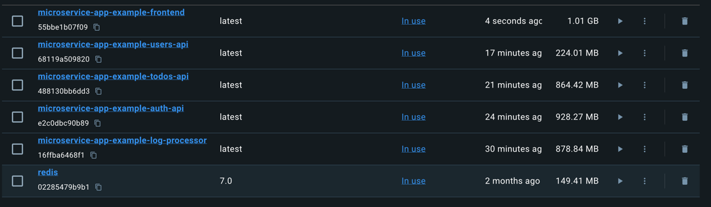
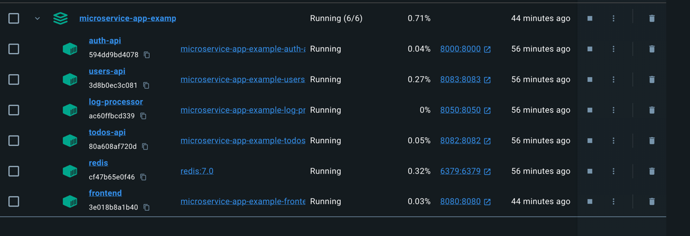
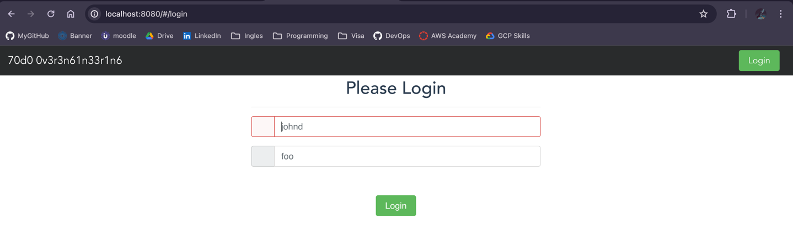
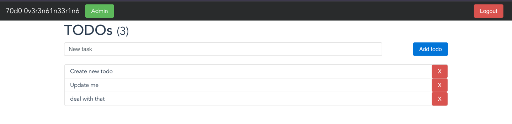
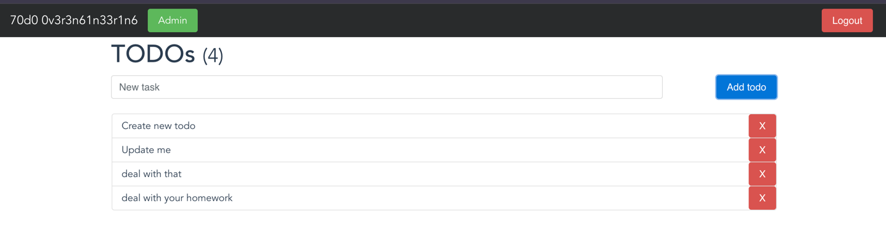

# Microservice App - PRFT Devops Training

This is the application you are going to use through the whole traninig. This, hopefully, will teach you the fundamentals you need in a real project. You will find a basic TODO application designed with a [microservice architecture](https://microservices.io). Although is a TODO application, it is interesting because the microservices that compose it are written in different programming language or frameworks (Go, Python, Vue, Java, and NodeJS). With this design you will experiment with multiple build tools and environments. 

## Components
In each folder you can find a more in-depth explanation of each component:

1. [Users API](/users-api) is a Spring Boot application. Provides user profiles. At the moment, does not provide full CRUD, just getting a single user and all users.
2. [Auth API](/auth-api) is a Go application, and provides authorization functionality. Generates [JWT](https://jwt.io/) tokens to be used with other APIs.
3. [TODOs API](/todos-api) is a NodeJS application, provides CRUD functionality over user's TODO records. Also, it logs "create" and "delete" operations to [Redis](https://redis.io/) queue.
4. [Log Message Processor](/log-message-processor) is a queue processor written in Python. Its purpose is to read messages from a Redis queue and print them to standard output.
5. [Frontend](/frontend) Vue application, provides UI.

## Architecture

Take a look at the components diagram that describes them and their interactions.


## Docker
First we need to build the images for each component. You can do it by running the following command in the root of the project:
```Docker
docker-compose up -d
```


## Usage
Once the images are built and the containers are running, 
you can access the application by going to [http://localhost:8080](http://localhost:8080) in your browser.





We have some initial data for you to test the application:

|  Username | Password  |
|-----------|-----------|
| admin     | admin     |
| johnd     | foo       |
| janed     | ddd       |


Or you can use the following curl command to get a JWT token:
```bash
curl -X POST  http://localhost:8000/login -d '{"username": "admin","password": "admin"}'
```
And then use the token to replace $token and do a GET request to the users API:
```bash
curl -X GET -H "Authorization: Bearer $token" http://localhost:8083/users/:username
```

Then, when you are inside your profile, you can create a TODO, and then you can see it in the TODOs list.



